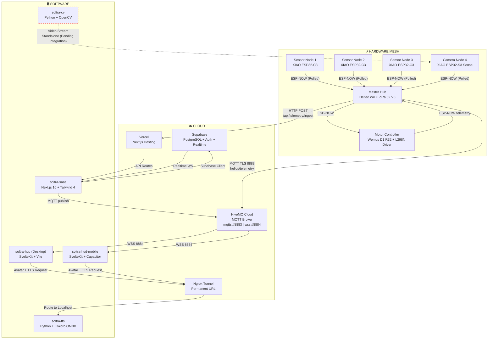

# Soltra

**🚀 1. Project Overview**

Soltra is a commercial-grade, distributed edge-computing solar tracking ecosystem. It combines autonomous embedded hardware, computer vision, cloud telemetry, and an AI-driven operator interface into a single cohesive platform. 

The system was built to solve the inefficiencies of static solar panels and traditional, dumb solar trackers by introducing a decentralized, AI-driven, and weather-predicting approach. By continuously calculating optimal pan and tilt angles through local sensor fusion (LDR, UV, IR) and astronomical ephemeris, it ensures maximum energy yield.

Designed for both residential (B2C) and agricultural fleet (B2B) markets, Soltra features a zero-collision ESP-NOW radio mesh for inter-device communication, HiveMQ for real-time cloud telemetry, and Supabase for persistent data storage. It bridges the gap between raw hardware and an enterprise SaaS experience.

---

**🏗️ 2. System Architecture (The Big Picture)**

The hardware layer operates autonomously using a fast, local ESP-NOW mesh network. The Master Hub gathers data from the Sensor Nodes and Motor Controller, then publishes telemetry to HiveMQ via WiFi. The Next.js SaaS backend ingests this telemetry via secure HTTP POST requests and stores it in a Supabase PostgreSQL database. Clients (the Vite Dashboard and SaaS UI) subscribe to Supabase Realtime for live updates. For voice commands and notifications, the SaaS acts as a proxy to a local Python FastAPI server running the Kokoro ONNX TTS engine over a permanent Ngrok Tunnel.



---

**📂 3. Directory Structure & Module Breakdown**

*   `hardware/soltra-master-hub`: 
    *   **What it is:** The "brain" of the hardware mesh, running on a Heltec WiFi LoRa 32 V3.
    *   **What it does:** Calculates sun positions, aggregates telemetry, and acts as the cloud gateway.
    *   **How it interacts:** Receives ESP-NOW data from sensors, controls the motor, and publishes to HiveMQ and the SaaS via HTTP.
*   `hardware/soltra-motor-controller`: 
    *   **What it is:** ESP32 Dev Kit motor driver.
    *   **What it does:** Drives the reliable L298N dual H-bridge motor driver and reads accelerometer/gyro data via an MPU6050.
    *   **How it interacts:** Communicates strictly with the Master Hub via ESP-NOW to report physical orientation and receive movement commands.
*   `hardware/soltra-sensor-node`: 
    *   **What it is:** Tiny, deep-sleep capable sensor corners running on Seeed XIAO ESP32-C3s.
    *   **What it does:** Uses LDRs, UV, and IR sensors to report raw light intensity.
    *   **How it interacts:** Broadcasts data to the Master Hub over the ESP-NOW mesh.
*   `hardware/soltra-camera-node`: 
    *   **What it is:** ESP32-CAM module.
    *   **What it does:** Provides an MJPEG video stream for operator oversight.
    *   **How it interacts:** Streams video directly over the local network to the Dashboards/HUDs.
*   `software/soltra-saas`: 
    *   **What it is:** The primary Next.js 16 commercial SaaS platform.
    *   **What it does:** Handles Supabase authentication, node registration, and customer-facing UI.
    *   **How it interacts:** Primary telemetry ingest point (HTTP POST) and proxies client requests to the TTS server.
*   `software/soltra-dashboard`: 
    *   **What it is:** A React/Vite standalone companion app.
    *   **What it does:** Features a Three.js 3D representation of the solar tracker for operators.
    *   **How it interacts:** Listens to Supabase Realtime for telemetry updates and connects locally to the TTS server.
*   `software/soltra-tts`: 
    *   **What it is:** A local Python FastAPI server.
    *   **What it does:** Handles text-to-speech generation using Kokoro ONNX for fast, 24kHz audio synthesis.
    *   **How it interacts:** Receives POST requests from the SaaS edge functions or local dashboards and returns WAV audio streams.
*   `software/soltra-hud` & `soltra-hud-mobile`: 
    *   **What it is:** SvelteKit applications for on-site technicians.
    *   **What it does:** Acts as a local-only, direct-MQTT operational HUD.
    *   **How it interacts:** Connects directly to HiveMQ over WebSockets (WSS).

---

**🔌 4. Hardware Integration**

The hardware ecosystem relies heavily on the Espressif ESP32 family for both processing power and wireless capabilities.
*   **Microcontrollers:** Heltec WiFi LoRa 32 V3 (Master Hub), Wemos D1 R32 (Motor Controller), and Seeed Studio XIAO ESP32-C3s (Sensor Nodes).
*   **Sensors & Actuators:** MPU6050 for tilt/pan sensing, TSL2591 and generic LDRs for light/UV sensing, and L298N motor drivers for actuation.
*   **Cloud Connectivity:** The Master Hub connects to a local 2.4GHz WiFi network (configured via a captive portal `WiFiManager`). It communicates directly with HiveMQ Cloud via MQTT (port 8883) and pushes bulk telemetry to the Next.js SaaS via secure HTTPS POST requests (`TELEMETRY_URL`). It maintains internal cohesion by utilizing the low-latency ESP-NOW protocol for offline peer-to-peer messaging.

---

**💻 5. Local Setup & Development Guide**

Follow these terminal commands to spin up the entire ecosystem locally:

```bash
# 1. Clone the repository and enter the workspace
git clone <repository-url> soltra
cd soltra

# 2. Setup soltra-saas (Next.js)
cd software/soltra-saas
npm install
cp .env.local.example .env.local 
# Edit .env.local to include your Supabase & HiveMQ keys
npm run dev
# SaaS is now running on http://localhost:3000

# 3. Setup soltra-dashboard (Vite + React)
# Open a NEW terminal
cd software/soltra-dashboard
npm install
# Ensure .env.local contains VITE_SUPABASE_URL, VITE_SUPABASE_ANON_KEY, and VITE_TTS_URL
npm run dev
# Dashboard is now running on http://localhost:5174

# 4. Setup soltra-tts (Python FastAPI)
# Open a NEW terminal
cd software/soltra-tts
pip install -r requirements.txt
# Ensure you have downloaded the kokoro-v1.0.onnx model and voices.json to this folder
python server.py
# TTS Server is now running on http://localhost:8099

# Run Ngrok Tunnel to expose the TTS server via a permanent URL
# Open a NEW terminal
ngrok http 8099
```

---

**🛠️ 6. Tech Stack & Dependencies**

*   **Frontend & Web Apps:** Next.js 16 (App Router), React 19, Vite, SvelteKit, Tailwind CSS v4, Framer Motion, GSAP, Three.js / React Three Fiber.
*   **Backend & Database:** Supabase (PostgreSQL, Auth, Realtime), Node.js.
*   **AI & Services:** Python 3, FastAPI, Kokoro ONNX (TTS), Chatterbox TTS, Ollama (Qwen 2.5:0.5b).
*   **IoT & Hardware:** C++ / Arduino Framework, ESP-NOW, MQTT.js, HiveMQ Cloud, FreeRTOS.
*   **Tools:** Vercel (Hosting), Ngrok (Tunneling).
